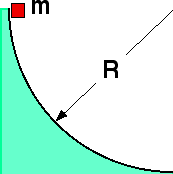

## The question for students:

{: .image-right } A mass
m slides down a frictionless track of radius R=0.5m.  As the mass
reaches the bottom, relative to the center of curvature, its angular
velocity is most nearly:

1. 6 rad/sec
2. 8 rad/sec
3. 12 rad/sec
4. 15 rad/sec
5. 20 rad/sec
6. Cannot be determined

## Commentary for teachers:

### Answer 

(1) The velocity near the bottom can be found using energy
conservation.
