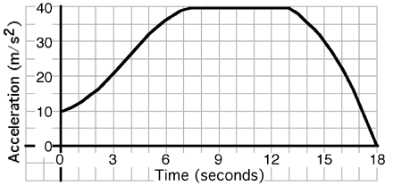

 An
object's motion is described by the graph above. The average
acceleration during the first 10 s is most nearly...

1. 0 m/s2
2. 20 m/s2
3. 30 m/s2
4. 40 m/s2
5. 50 m/s2
6. Other

###Answer 

(3) Students may have difficulty understanding what they are
asked. Recasting the problem in terms of areas helps. The only
contenders should be #2 or #3. Counting blocks should make it clear that
the result is much closer to #3.
