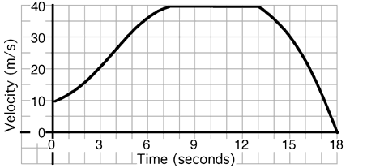

 An
object's motion is described by the graph above. The instantaneous
acceleration at t=10 sec is most nearly...

1. 0 m/s2
2. -2 m/s2
3. 3 m/s2
4. -4 m/s2
5. 5 m/s2
6. Other

###Answer 

(1) Useful follow-up questions include; when does the object have
positive acceleration, when negative acceleration; does the object ever
stop?; when is it farthest from the origin?
