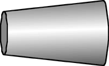

## The question for students:

{: .image-right } An
ohmic conductor is carrying a current.  The cross-sectional area of the
wire changes from one end of the wire to the other.  Which of the
following quantities vary along the wire?

<blockquote> <ol type="A"> <li>The resistivity</li> <li>The current</li>
<li>The current density</li> <li>The electric field</li> </ol>
</blockquote>

1. A only
2. B only
3. C only
4. D only
5. A and B only
6. C and D only
7. A, B, C, and D
8. None of the above

## Commentary for teachers:

### Answer 

(6) Students are likely to appreciate that the current density
varies and that the total current does not. Many will not recognize that
the electric field is related to the current density.
