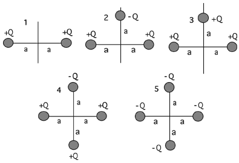

Which of the following charge distributions has the lowest electric
potential at the origin?

###Answer 

(5) This question serves to motivate a discussion of the
difference between potential energy in a configuration and the
electrostatic potential at a point. It is also important to stress that
potential when point charges are involved presumes that infinity is the
reference point.
...
