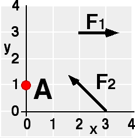

## The question for students:

{: .image-right } Given
F1 = 6N, and F2 = 8N, what is the total torque
about point A?

1. 1.0 N-m, out
2. 0.7 N-m, in
3. 7.0 N-m, out
4. 1.0 N-m, in
5. 6.0 N-m, out
6. None of the above.

## Commentary for teachers:

### Answer

(6) Many students use the origin rather than the point A. This provides
the opportunity to stress that torque is found with respect to a
specified point. Students using the right hand rule incorrectly may
answer #2.

