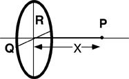

{: .image-right } A ring
of radius R with charge +Q (uniformly distributed) is positioned as
shown.  What is the electric field at a point on the axis, a distance x
from the origin?

1. 

2. 

3. 

4. 

5. 

6. 

7. None of the above.

###Answer 

(4) Discuss how the form of the field can be reasoned from symmetry and units. Together with limiting value as x goes to zero, this uniquely singles out one answer.

A good follow-up activity is to have students sketch a graph of the field and potential along the x-axis.
