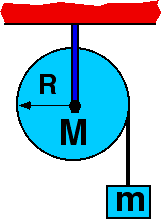

{: .image-right } A
disk, having radius R and mass M, is free to rotate about an axis
through its center.  A massless string is wound around disk and attached
to mass m.  The moment of inertia for a disk given by is
1/2(MR2).  If M=4m what is the acceleration of mass m?

1. 0
2. g/2
3. g/8
4. g/5
5. g/3
6. None of the above
7. Cannot be determined

### Answer

(5) Students answering #2 are likely making the common mistake of
thinking that the tension in the string is mg.
