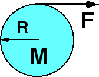

{: .image-right }  A
disk, with radius 0.25 m and mass 4 kg, lies on a smooth
<b>horizontal</b> table.  A string wound about the disk is pulled with a
force of 8N. What is the acceleration of the disk?

1. 0
2. 0.5 m/s2
3. 1 m/s2
4. 2 m/s2
5. 4 m/s2
6. None of the above.
7. Cannot be determined

###Answer

(4) Students find it difficult to grasp that the angular dynamic
relationship does not replace, but rather augments, the 2nd law.
