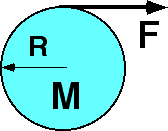

{: .image-right } A
disk, with radius 0.25 m and mass 4 kg, lies on a smooth
<b>horizontal</b> table.  A string wound about the disk is pulled with a
force of 8N. What is the angular acceleration of the disk about its
center?

1. 0
2. 64 rad/s2
3. 8 rad/s2
4. 4 rad/s2
5. 12 rad/s2
6. None of the above.
7. Cannot be determined

### Answer

(6) The correct value of &alpha;cm is 16 rad/s2. Students have the erroneous
concept of 'conservation of force'. Many think that since the disk
moves, the full force cannot contribute to the torque about the center
of the disk.

