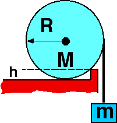

{: .image-right } A disk
on a horizontal surface sits against a curb.  A string wound around the
disk is attached to a mass as shown.  If R=5 cm and h=2 cm, the largest
m for which the disk will not move is

1. Less than 2M
2. 2M
3. 3M
4. 4M
5. 5M
6. Greater than 5M
7. Cannot be determined.

###Answer

(4) When m = 4M the torques about the contact point between the disk and
curb balance. Students find this problem very difficult although rather
simple. Many have the most difficulty with the simple geometry needed to
find the moment arms.
