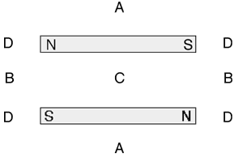

{: .image-right } Two
identical bar magnets are placed rigidly and parallel to each other as
shown.  At what locations, if any, is the net magnetic field close to
zero?

1. A only
2. B only
3. C only
4. D only
5. A and B
6. A, B, and C
7. C and D
8. None of the above.

###Answer 

(3) C is the point of weakest field. The field is weak at A also.
Find out student reasons is more important than the answer. Have
students sketch the field lines. Ask them how is the strength of the
field indicated on a field line diagram.
...
