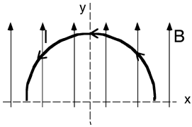

{: .image-right } A
semicircular wire lies in a plane as shown.  The positive z-direction is
out of the plane. The wire has current, I, in the counterclockwise
sense, and it is in a uniform external magnetic field, B, directed along
the +y axis.  What is the direction of the net force, if any, acting on
the wire?

1. +x
2. -x
3. +y
4. -y
5. +z
6. -z
7. None of the above.

###Answer 

(6) Since the current carrying semicircle lies in the x-y plane,
as does the magnetic field, the net force, if any, must point
perpendicular to the plane, or in the z direction. For the semicircular
wire, all force contributions add. There is no contribution to the net
force from current elements near the x-axis.

The force on the missing half of the loop would be out of the page.
Together both forces on a full loop would create a torque tending to
align the field of the current loop with the external field. If
appropriate relate this situation to the torque on a magnetic dipole.
