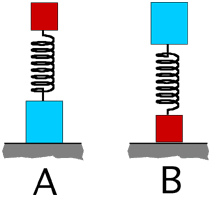

{: .image-right } Two
blocks are connected to the ends of a spring as shown. Assume that the
mass is proportional to the size of the block.  The spring is compressed
(same amount) and  released suddenly.  In which orientation will the
system achieve the largest height?

1. A
2. B
3. both go to the same height
4. cannot be determined

###Answer 

(2) This is a very rich problem for reasoning. It IS possible for
students to reason to the correct solution if they consider appropriate
concepts. To help them along suggest the following: Draw free body
diagrams for each of the masses separately. Combine them to get a valid
free body diagram for the system. Such a process reveals that the normal
force is responsible for the impulse causing the system to jump. The
spring force is internal to the system and does not appear on the
system's free body diagram.

Students can deduce the answer using analogy or experience. Pogo sticks
or even the human body are analogous systems.
...
