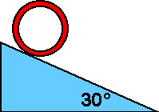

{: .image-right } A hoop
of mass 4 kg and radius 10 cm rolls without slipping down an incline
30&deg; to the horizontal.  The acceleration of the center of the hoop
is most nearly

1. 10 m/s2
2. 5 m/s2
3. 3.5 m/s2
4. 2.5 m/s2
5. none of the above
6. cannot be determined

###Answer 

(4) Students should realize that the acceleration must be less
than a sliding mass on a frictionless surface would have which is #2.
Engage the students in a discussion of why the acceleration cannot
depend upon the radius.
