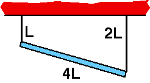

{: .image-right }  A
uniform rod of length 4L, mass M, is suspended by two thin strings,
lengths L and 2L as shown.  What is net torque about the left end of the
rod?

1. 0
2. 4MgL
3. 8MgL
4. 12MgL
5. None of the above

###Answer 

(1) Since the rod does not rotate the total torque must be zero
about any point. Many students overworry this problem not realizing
that, independent of the angle of the rod, the other string is twice as
far as the center of mass of the rod.
