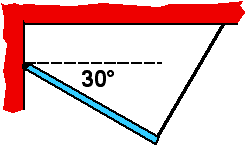

## The question for students:

{: .image-right } A
uniform rod is hinged to a wall and held at a 30&deg; angle by a thin
string that is attached to the ceiling and makes a 90&deg; angle to rod.
The tension in the string is 10N.  The weight of the rod is about

1. 13N
2. 18N
3. 20N
4. 23N
5. 40N
6. none of the above

## Commentary for teachers:

### Answer 

(4) Some students will use the wrong trigometric function and
conclude that the weight is 40N.

An interesting follow up question is to ask what is the hinge force.
Students often forget that both the sum of the forces and the sum of the
torques must be zero for static equilibrium.

