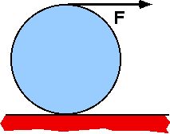

{: .image-with-caption } A
uniform disk with R=0.2m rolls without slipping on a horizontal surface.
 String is pulled in the horizontal direction with force 15N. Moment of
inertia of disk is 0.4 kg-m2. The acceleration of the center
of the disk is most nearly

1. 0.5 m/s2
2. 1 m/s2
3. 4 m/s2
4. 7.5 m/s2
5. 10 m/s2
6. none of the above

###Answer 

(2) This problem can be done without knowing anything about the
friction force. To do so, though, requires knowing the Parallel Axis
Theorem for moments of inertia and the constraint between the linear and
rotational rates of motion for a rolling object. An alternate method is
to write the two equations for the linear motion of the center of mass
and the torque relation for rotation about the CM and then eliminate the
friction from the two equations.
...
