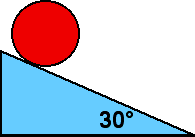

{: .image-right } A
uniform disk with mass M and radius R rolls without slipping down an
incline 30&deg; to the horizontal.  The acceleration of the center of
the disk is

1. g/2
2. 2g/3
3. 3g/4
4. g/4
5. none of the above

###Answer 

(5) The acceleration must be smaller than for a mass sliding on a
frictionless incline, but larger than for a hoop. Application of the
rotational dynamic relation τ = Ipαp about point P, the disk's contact
point with the incline yields an acceleration of g/3. Students must know
the moment of inertia of the disk about its center and use the Parallel
Axis Theorem.

Good discussion questions are: Would a marble have a larger or smaller
acceleration than a coin? Would the angle of the incline matter?
...
