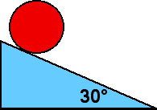

{: .image-right } A
uniform disk with mass M and radius R rolls without slipping down an
incline 30&deg; to the horizontal.  The friction force acting through
the contact point  is

1. 0
2. Mg/3
3. Mg/4
4. Mg/6
5. none of the above

###Answer 

(4) This problem requires students to use the 2nd law written in
terms of the CM acceleration and the rotational dynamic relation written
about the CM or the contact point. In either case they also need the
geometric constraint for rolling. This is a difficult problem for
students requiring a lot of additional knowledge, such as the moment of
inertia for a disk and, depending upon solution method, the Parallel
Axis Theorem.

Having gone to the trouble of solving the problem it is best to make
sure that the students glean as much as they can. A good followup
question is which would have a larger friction force, a hoop, a disk or
a sphere. They may try to reason from the acceleration of these objects
that the larger the acceleration, the smaller the friction force. The
friction force depends upon the mass, however, and the question cannot
be answered without knowledge of the masses.
