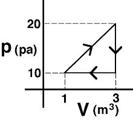

{: .image-right } An
ideal gas is taken around the process shown.  The net work done
<u>on</u> the gas is most nearly...

1. 20 J
2. -30 J
3. 15 J
4. -10 J
5. none of the above
6. cannot be determined

###Answer 

(4) The work done ON the system is the negative of the area of
the triangle. Students selecting answer #1 or #3 need to be sensitized
to the difference between work done on the gas versus by the gas.
...
