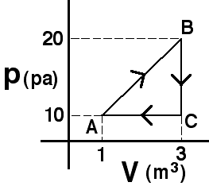

{: .image-right } An
amount of an ideal gas is taken around the process shown.  Which of the
following statements about the internal energy of the states is true?

1. The internal energy of state B is twice that of state C.
2. The internal energy of state B is equal to that of A and C combined.
3. The internal energy of state A is half that of state C.
4. The internal energy of state B is less than the internal energy of state
   A.
5. none of the above
6. cannot be determined

###Answer 

(1) Students need to know only that the internal energy depends
upon the product of p and V. Alternatively, they can reason that,
according to the Ideal Gas Law, this product is proportional to the
temperature and the temperature determines the internal energy
...
