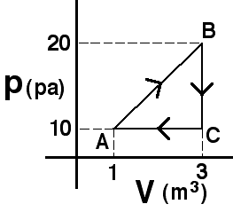

## The question for students:

{: .image-right } An
amount of an ideal gas is taken around the process shown.The amount of
heat extracted during process BC is

1. 10 J
2. 20 J
3. 15 J
4. 45 J
5. 60 J
6. none of the above
7. cannot be determined

## Commentary for teachers:

### Answer 

(4) Since no work is done the change in internal energy must be
due to heat extraction. Some students may think that the answer cannot
be determined because they do not know the number of moles. These are
likely thinking that they need to find the temperature at each state to
answer the question.
