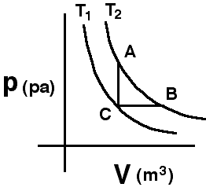

## The question for students:

{: .image-right }  The
two curves shown are isotherms. A system is taken from state A to state
B along the T2 isotherm.  State C has the volume of state A
and the pressure of state B. 

Which of the following is true:

1. QAB = 0
2. QAB = ΔEAB
3. QAB = -WAB
4. QAB = QCA-QCB
5. Not enough information

## Commentary for teachers:

### Answer 

(5) This is the only answer that is definitely correct. Students
will likely assume that the system is an ideal gas. Many will choose #3
and this should engender a discussion of the sign of work. Physicists
use the convention that positive work is that done BY the system.
Chemists frequently use the opposite convention.

The one choice giving students the most reasoning difficulty is #4. A
reasoning path that eliminates that choice is as follows. Q(AB) is
positive: gas does positive work on surroundings, so heat has to be
added to keep energy the same. Q(CA) is positive: no work is done, so
heat has to be added to raise the temperature. Q (CB) is positive: heat
must be added to expand the gas and still maintain constant pressure. So
Q(CB) [constant pressure] > Q(CA) [constant volume]; Q(CA) - Q(CB) < 0
cannot equal Q(AB) > 0
