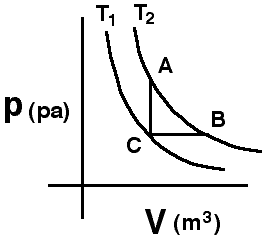

{: .image-right }  A
system consisting of a quantity of ideal gas has the two isotherms
shown.  The system, initially at state C, can be taken along path CA to
final state A or along path CB to state B.

Which of the following is true:

1. QCA < QCB
2. QCA = QCB
3. QCA > QCB
4. Not enough information

###Answer 

(1) Since the internal energy of an ideal gas depends only on
temperature, states A and B have the same internal energy. Along path CB
the system does work requiring more heat to be added than along path CA.
...
