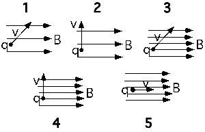

In the following situations a charge q moves in a uniform magnetic
field.  The strength of the magnetic field is indicated by the density
of field lines.  In all cases the speed of the charge is the same.  For
which situation(s) will the charge q travel the greatest distance in a
given time T?

1. 1
2. 2
3. 3
4. 4
5. 5
6. 1 & 3
7. 2 & 4
8. 1, 2, 3 & 4
9. 1, 2, 3, 4 & 5
10. Cannot be determined

###Answer

(9) The magnetic force can change the direction of the velocity but not
the speed. The distance traveled, therefore, cannot depend upon either
the strength or orientation of the magnetic field.  It is important to
have students who pick one of the other choices verbalize their reasons.
 Some students may interpret the question as asking for the
'displacement' and, thinking that the time is needed, respond #10.
Actually the result for displacement is #5.

