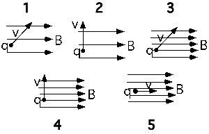

In the following situations a charge q moves in a uniform magnetic
field.  The strength of the magnetic field is indicated by the density
of field lines.  In all cases the speed of the charge is the same.   For
which situation(s) will the charge q have the largest displacement in a
given time T.

1. 1
2. 2
3. 3
4. 4
5. 5
6. 1 & 3
7. 2 & 4
8. 1, 2, 3 & 4
9. 1, 2, 3, 4 & 5
10. Cannot be determined

### Answer

(5) Since the speed cannot change, the greatest displacement will occur
when the path is a straight line.  Some students may answer #10 thinking
that the time matters.
