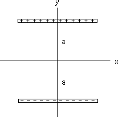

{: .image-right } Two
uniformly charged rods are positioned horizontally as shown.  The top
rod is positively charged and the bottom rod is negatively charged.  The
total electric field at the origin

1. is 0
2. has both an x, and a y component
3. points totally in the i direction
4. points totally in the -i direction
5. points totally in the j direction
6. points totally in the -j direction

###Answer 

(6) By symmetry the field must point along the y-axis. Students
who do not understand that the field points away from positive charges
and towards negative charges would select #1 thinking that the fields
cancel.
...
