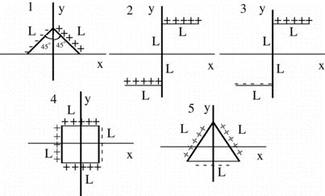

For which of the configuration(s) below does the total electric field
vector at the origin have non-zero components in both the x and y
directions?

1. 2 only
2. 1 and 3 only
3. 5 only
4. 4 only
5. 1 and 5 only
6. None of the above

### Answer

(6) Only situation 3 meets the condition. A good exercise is to have
students draw the contribution to the field at the origin due to each
rod. The contributions should have the correct relative size and
direction.
