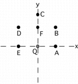

{: .image-right } 
Charge, Q, is at the origin. Points A-E are positions where other
charges may be present. Etotal at point F is non-zero and
points in the +<b>i</b> direction.  Which of the following situations
could account for this?

<blockquote> <ol type="A"> <li>Another charge is present at position
A.</li> <li>Two other charges are present at C & D.</li> <li>Two other
charges are present at D & B.</li> <li>Two other charges are present at
E & A.</li> </ol> </blockquote>

1. A only
2. B only
3. C only
4. D only
5. A and B
6. A, C and D
7. A, B, and D
8. A, B, C, and D

###Answer

(2) Only a charge at C can counter the y component of the field of Q at
F. A charge at B or D can then create a field at F that points in the i
direction.

