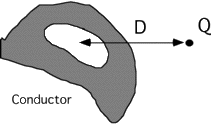

## The question for students:

A positive charge +Q is placed outside a neutral conductor.  Inside the
conductor is a cavity containing no charge.  What is the electric field
at the "center" of the cavity, a distance D from the charge +Q?

1. kQ/D2, direction away from the charge Q
2. kQ/D2, direction toward the charge Q
3. kQ/D2, direction away from the center of the conductor
4. kQ/D2, direction toward the center of the conductor
5. E = 0
6. Cannot determine the electric field

## Commentary for teachers:

### Answer

(5) Induced charges and resulting fields pose problems for most
students. Having students compare this case to one where the charge is
inside the cavity helps. They tend to get hung up on the problem of
envisioning the exact distribution of induced charge that will cancel
the field everywhere inside the conductor. 
