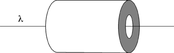

A positive charge per unit area &sigma; is placed on a cylindrical
conductor of inner radius, r = a, and outer radius, r = b.  A positive
charge per unit length, &lambda;, is placed along the axis of the
cylinder.  What is the charge density (charge per area) on the outer
surface?

1. +&lambda;
2. +&sigma;
3. -&lambda;
4. -&sigma;
5. &sigma;+&lambda;/(2&pi;a)
6. &sigma;-&lambda;/(2&pi;a)
7. &sigma;+&lambda;/(2&pi;b)
8. &sigma;-&lambda;/(2&pi;b)
9. None of the above

###Answer

(7) The biggest problem for students is finding the induced surface
charge density due to the line charge density. 
