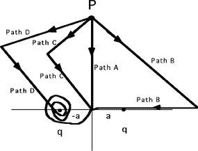

Two point charges are fixed on the x-axis.  A positive charge from point
P to the origin along the different paths shown in the diagram below. 
For which path would you do the most work?

1. Path A
2. Path B
3. Path C
4. Path D
5. Cannot be determined
6. None of the above

###Answer

(6) Relating the work done to the change in potential should be
stressed. Once this point is made, a good follow-up question is to ask
how much work would be done if one of the charges on the x-axis was
negative.
