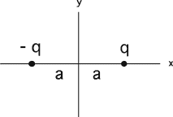
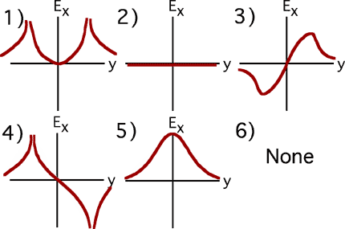

{: .image-with-caption } We have a charge configuration
(shown at the right). Which graph below resembles the plot of the <b>x
component</b> of the electric field, Ex(y), <b>as you move
along the y-axis?</b>

 

###Answer

(6) The correct graph looks like the negative of graph #5. Some students
pick #5 thinking that the magnitude of the field is desired.
...
