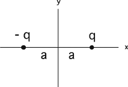
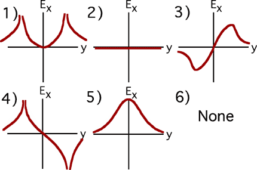

{: .image-right } We have a charge configuration
(shown at the right). Which graph is the plot of Ex(x), the
<b>x component</b> of the electric field, <b>as you move along the
x-axis?</b>

 

###Answer

(6) Students should recognize that the field goes singular at the
charges. The only graphs doing that, #1 and #4, are eliminated because
the x-component of the field must be negative everywhere between the two
charges. Have students sketch the graph.
