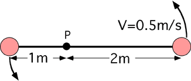

Two masses, attached to the ends of a rigid massless rod, are rotating
about pivot P as shown in the picture below.  The mass two meters from P
has speed 0.5m/s.  What is the acceleration of the mass one meter from
P?

1. 0.05 m/s2
2. 0.0625 m/s2
3. 0.125 m/s2
4. 0.250 m/s2
5. 0.5 m/s2
6. 1 m/s2
7. None of the above
8. Cannot be determined

### Answer

(2) Every one of the possible wrong responses indicates a common error
that students make. After the problem has been discussed it is useful to
have students find the acceleration of the mass at 2m and see that the
accelerations are in the same ratio as the velocities. Drawing vector
diagrams showing the Δv for each mass is useful for explaining this
relationship.
