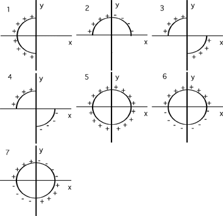

All of the curved charged rods shown in the image below have the same
radius and linear charge density (though some are positively charged and
others are negatively charged).  For which configuration would the
magnitude of E at the origin be greatest?

### Answer

(6) This problem constitutes a good exercise for students learning the
vector nature of the electric field. There are many good followup
questions, such as; Which configurations have zero field at the origin?,
Order the configurations by increasing magnitude of electric field at
the origin. Stress the value of symmetry for reasoning to the answer. A
negative distribution in a quadrant is equivalent to a positive
distribution in the opposite quadrant, which means that distributions #5
and #7 are equivalent (for purposes of finding the E field at the
origin). 
