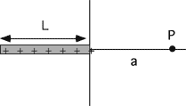

{: .image-right } A rod of length L and charge +q
(uniformly distributed) is positioned along the x-axis, as shown to the
right.  What is <b>E</b> at point P, a distance a from the origin?

 

<table cellpadding=2 border=0> <tr><td>1. 

</td></tr> <tr><td>2. 

</td></tr> <tr><td>3. 

</td></tr> <tr><td>4. 

</td></tr> <tr><td>5. 

</td></tr> </table>

###Answer

(3) It is worthwhile having students examine their choice for the
limiting case a->0. Students are inclined to immediately start a formal
calculation rather than think about the problem long enough to figure
out what they really need to know. In this case all but two of the
answers can be ruled out because they do not limit appropriately as the
point P moves toward the origin. If a>>L the field should drop off as
from a point charge. The only answer meeting both these requirements is
3. 
...
