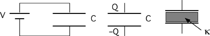

A capacitor with capacitance C is connected to a battery until charged,
then disconnected from the battery.  A dielectric having constant
&kappa; is inserted in the capacitor.  What changes occur in the charge,
potential and stored energy of the capacitor after the dielectric is
inserted?

1. V stays same, Q increases, U increases
2. V stays same, Q decreases, U stays same
3. V increases, Q decreases, U increases
4. V decreases, Q stays same, U decreases
5. None of the above
6. Cannot be determined

###Answer

(4) It should be clear to students that the charge cannot change. Most
students recognize that capacitance increases when a dielectric is
inserted into a capacitor. The issue then becomes whether they
appreciate the relationships between C, Q, V and U.
...
