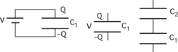

A capacitor, C1, is connected to a battery until charged, and
then disconnected from the battery.  A second capacitor, C2,
is connected in series to the first capacitor.  What changes occur in
capacitor C1 after C2 is connected as shown?

1. V same, Q increases, U increases
2. V same, Q decreases, U same
3. V increases, Q decreases, U increases
4. V decreases, Q same, U decreases
5. None of the above
6. Cannot be determined

###Answer

(5) All quantities remain the same. Some students may consider the
capacitors to be connected in parallel despite the figure. 
