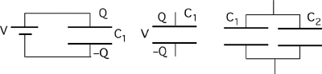

## The question for students:

A capacitor having, C1, is connected to a battery until
charged, then disconnected from the battery.  A second capacitor,
C2, is connected in parallel to the first capacitor.  Which
statements below are true?

1. Charge on C1 decreases.
2. Total charge on C1 and C2 is the same as the original Q.
3. The total energy stored in both capacitors is the same as the
   original U stored in C1.
4. The potential (Voltage) across C1 decreases.
5. All of the above. 
6. Only 1, 2, and 3 are true. 
7. Only 1, 2, and 4 are true.

## Commentary for teachers:

### Answer

(7) Statement #3 is the hardest for students to reason about. This is
most easily decided as incorrect if the two capacitors are taken as
equal.
