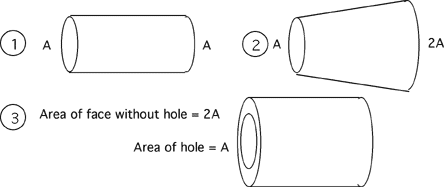

## The question for students:

Which object below has the lowest resistance?  All three have length L
and are made out of the same material.

1. #1
2. #2
3. #3
4. Both #1 and #3 have the same, and theirs is less than the resistance of
   #2.

## Commentary for teachers:

### Answer

(2) Students should be able to reason that the contribution to the total
resistance from a slice of material decreases as the area increases. 
