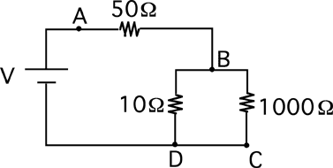

Consider the circuit below.  How does the voltage difference between
points A and C compare to the voltage difference between points A and D?

1. VAC < VAD

2. VAC = VAD

3. VAC > VAD

4. Cannot be determined

###Answer

(2) It is interesting to find out how many students recognized that the
comparison did not require the use of Ohm's law. To gauge student
understanding it is interesting to ask questions such as; does any
current flow in the wire between C and D? If C and D are at the same
potential, why does any current flow? 
...
