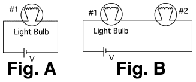

## The question for students:

A light bulb is connected to a battery as shown in Figure A below. When
a second bulb is connected as shown in Figure B, what happens to the
brightness of the original bulb?

1. Increases
2. Decreases
3. Stays the same
4. Bulb goes out
5. Can't determine

## Commentary for teachers:

### Answer

(2) Depending upon the bulbs and battery, the bulbs could appear to go
out. 
