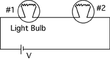

Two light bulbs are connected to a wall outlet as shown below.  Bulb #1
is 100W and Bulb #2 is 40W.  Which statement is true?

1. Both bulbs are at their normal brightness.
2. The 100W bulb is brighter than the 40W bulb.
3. The 40W bulb is brighter than the 100W bulb.
4. Both bulbs are at equal brightness.
5. Cannot determine their relative brightness.

###Answer

(3) Since the resistance of the bulbs goes as the reciprocal of its
wattage, students can reason that the most power is dropped in the 40W
bulb. Another way to reason is this. Suppose the potential source was
such that the potential difference over the 40W bulb was 120V, i.e. its
normal operating condition. The potential difference over the 100W bulb
is then 48V, which means that it is operating at (48/120)2 of its normal
condition. The bulb is dissipating about 16W.
