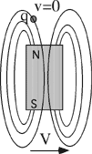

{: .image-right } A bar
magnet moving with speed V passes below a stationary charge q.  What can
be said about the magnitude of the magnetic force on the bar magnet and
the charge q.

1. Fbar and Fq are both zero.

2. Fbar is zero and Fq is not zero.

3. Fbar is not zero and Fq is zero.

4. Fbar and Fq are both non-zero.

###Answer

(4) Many students have a lot of difficulty with this one. All of their
past experience has been with a moving charge in a magnetic field. They
may not think that it is equivalent to view the interaction from the
bar's frame. Of course, they are correct, but the difference is
unimportant for purposes of recognizing that the force on the charge is
non-zero. They may invoke the third law by rote, without perceiving any
mechanism that could provide a force on the magnet. Discussing this in
some detail is a good idea. 
...
