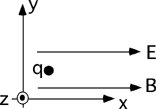

{: .image-right } A
charge is released from rest in E and B fields.  Both fields point along
the x axis. Which of the following statements regarding the charge's
motion are correct?

1. The charge will travel along a straight-line path.
2. The charge's speed will change as it travels.
3. The charge will travel in helical path.
4. The charge will travel in helical path of increasing pitch.
5. The charge will travel in a circle in the x-y plane.
6. 1 and 2 only
7. 2 and 4 only
8. None of the above

### Answer

(6) The different responses reveal the extent to which students
understand vector cross products and/or read the problem carefully. Some
students choose #8 because they do not like the way the motion is
expressed. They prefer descriptions such as, the charge first moves in a
straight line until it gets some speed then ...
