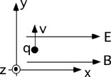

{: .image-right } A
charge has an initial velocity parallel to the y-axis in E and B fields.
Both fields point along the x axis. Which of the following statements
regarding the charge's motion are correct?

1. The charge will travel along a straight-line path.
2. The charge's speed will change as it travels.
3. The charge will travel in a helical path.
4. The charge will travel in a helical path of increasing pitch.
5. The charge will travel in a circle in the x-y plane.
6. 1 and 2 only
7. 2 and 4 only
8. None of the above

###Answer

(7) A common response is #4 because they forget that increasing pitch
implies that the speed changes. 
