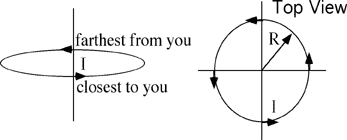

The diagram shows a circular wire loop of radius R carrying current I. 
What is the direction of the magnetic field, B, at the center of the
loop?

1. Left
2. Right
3. Up
4. Down
5. None of the above

###Answer

(3) This is the best response given the choices. The question poses
little difficulty for students who have learned about the magnetic field
of current loops as a magnetic dipole. For these students this question
just confirms their knowledge. For students who are trying to apply the
Biot-Savart law to the loop as a set of current elements the question is
more challenging. 
