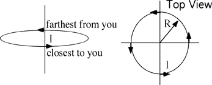

The diagram shows a circular wire loop of radius R carrying current I. 
What is the magnitude of the magnetic field, B, at the center of the
loop?

1. 0
2. μ0I/4πR
3. μ0I/2πR
4. μ0I/4R
5. μ0I/2R
6. None of the above.

###Answer

(5) This question serves to identify students who do not know how to
apply the Biot-Savart law and/or those who are recalling the field due
to an infinite wire. This provides a good opportunity to discuss why
Ampere's law is inappropriate for this case. 
...
